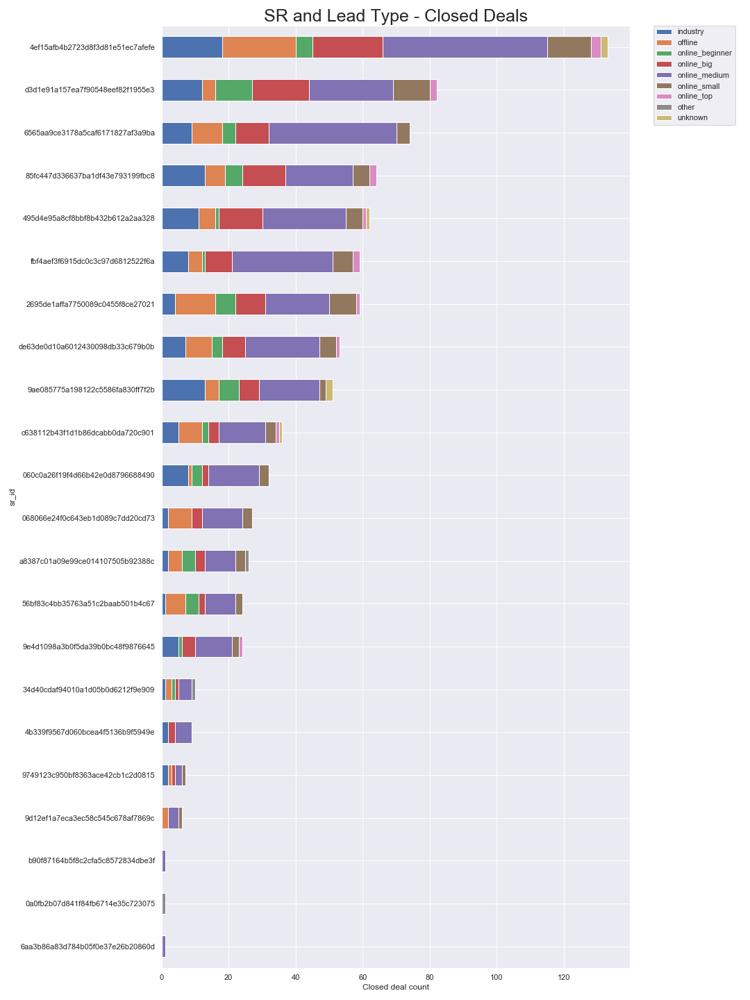
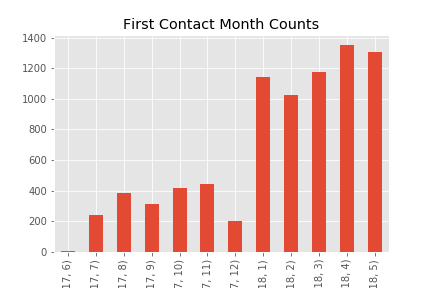

# adnu-sales-analytics
Analysis of marketing funnel dataset provided by a fictional organization adnu, the largest department store in Latin American marketplaces.

## Objectives
To answer these questions from analysing the data.
1. SR/SDR Optimization:

    Which SR or SDR should talk with each kind of lead?

2. Closing Prediction:

    Which deals will be closed?

3. Customer Lifetime Value:

    How much a customer will bring in future revenue?
## Major Findings

### Data Related Summary
1. MQL Data
    - **8000** unique **MQL IDs**
    - Roughly **5.5k** is `online searches, social media and direct traffic` (70%), **12%** is `unknown` and rest are sources like `email,referrals`etc.
    - 2018 data is much more (**3x, roughly ~6k**) in comparison to 2017 data (**~2k**).
2. Closed Leads Data
    - **842** unique `MQL_IDs` showing 842 closed deals mapped to unique seller_ids (**1-1 mapping**)
    - **32** unique Sales Developement Representative `SDR` with the max one SDR converted was **140** sellers
    - **22** unique Sales Representatives `SR` with the max on SR related to **133** unique sellers.
    - **33** unique `business segments` with `home_decor` being the most closed segment (**105 leads**)
    - **8** unique `lead types` with `online_medium` being the most popular one (**332 leads**)
    - **9** unique `lead behaviour` profiles with `CAT` being most popular one (**407 leads**)
    - There is not much data for columns `has_company`, `has_gtin`, `average_stock` and `declared_product_catalog size`
    - **3** unique `business types` with `reseller` being the most popular one (**587 leads**)
    - Top 5 SDRs contribute to 50% of the closed deals. Same goes for SRs
    - The closed deal data starts from `December 2017` and is at peak in `April 2018`.
3. Sellers Data
    - **3095** unique sellers
    - **611** unique cities in which these sellers reside
    - **23** states
4. Orders Data
    - `112650` **orders** data with `98666` unique order ids (meaning ~12% (13984) orders contains more than one item).
    - `32951` unique **products** which are ordered.
    - `3095` unique **sellers**.
    - Mean average **cost per order** is `120` with minimum order amount being `0.8` and maximum being `6735`.
    - Mean average **frieght value** amount per order is `20` with minimum value at `15.8` and maximum going to `401`.

### Objective Related
#### 1. What is the average number of days taken to convert a lead to closed lead?
    Average number of days - 49, left skewed date ranges with many outliers

#### 2. Who are the top performers (SDRs and SRs) 
    Total closed deals - 841

    Top 3 SDRs  -

    `4b339f9567d060bcea4f5136b9f5949e` (140), `068066e24f0c643eb1d089c7dd20cd73` (81), `56bf83c4bb35763a51c2baab501b4c67` (74)    

    Top 3 SRs - 

    `4ef15afb4b2723d8f3d81e51ec7afefe` (133),`d3d1e91a157ea7f90548eef82f1955e3`(82),`6565aa9ce3178a5caf6171827af3a9ba` (74)

    Top 3 Pairs of SDR and SRs -

    1. SDR - `4b339f9567d060bcea4f5136b9f5949e` SR -`  4ef15afb4b2723d8f3d81e51ec7afefe`    **21 closed deals together**
    2. SDR - `de63de0d10a6012430098db33c679b0b` SR -`  d3d1e91a157ea7f90548eef82f1955e3`    **19 closed deals together**
    3. SDR - `4b339f9567d060bcea4f5136b9f5949e` SR -`6565aa9ce3178a5caf6171827af3a9ba` **18 closed deals together**

#### 3. Which business segment is closed the most by SDRs + SRs

    `Home Decor`, `Health and Beauty`, `Car_accessories`, `household_items` are few of the top business segmetns where deals were closed with business types who are usually resellers and manufactures

#### 4. In the closed deals, which sellers have declared their revenue alongwith segment which can be used to guesstimate income/revenue of adnu 

    1. Total number of closed companies are:-  **841**

    2. Total number of companies about which Adnu provided who declared monthly revenue:  **45**

    3. Total percentage information for closed company revenues - **~5.5%**

#### 5. What are the best origin sources for leads which got converted?

    In the raw MQL data, online search `(organic and paid)` took up 50% and `social, email and referral` took up 26%. Rest was through different sources.

    In the closed deals data, online search `(organic and paid)` took up 55% and `social, email and referral` took up 15%. Rest was through different sources. 

    We see a growth of unknown sources from **17%** in MQL data to **23%** in closed deals data.

    We can also see how SDRs are interacting with the leads and closed counts for each origin source containing different SDRs who are prominent in converting from online searching.
    #### Cleaned Closed Deals with SDR

#### 6. Lack of data?

    We see that we had got the data of **841 closed deals** mapped from **8000** MQL dataset.

    When combined with seller dataset, we see that out of those 841 closed deals, we have only **379** present out of **3095** sellers in seller dataset **(~45%)** and rest seller data we don't have.

## Modelling and Predictions to answer objectives
### 1. For Q1 - Optimizing SR/SDR process flow
    

    **From these plots, it is evident that**
    
      1. SRs aren't assigned only specific business segments as they are getting exposed to all segments. They are given leads as and when they come.
      2. This also shows that some SRs are just good at selling anything irrespective of the lead type or business segment.

      Eg - SR_id - `4ef15afb4b2723d8f3d81e51ec7afefe` has 133 closed deals ranging in myriad of business segments which are unrelated and from all types of leads (online,offline,email,industry,etc)

      3. From 2017 to 2018 we have a significant rise in leads and therefore also a significant rise in closed leads 

Though, the significant rise is not due to a more effective process, rather because more leads fill in the forms on the landing pages.

We see two landing pages holding ~50% of the closed deals out of a total of 495 landing pages.

### For Q2 - Leads close or not

Predicting `closing days` (derived by taking difference of won_date and first_contact_date) i.e days taken to close a deal by selecting features which are there in mql table namely

- landing_page_id
- origin
- contact_month (derived from first_contact_date)
- contact_year (derived from first_contact_date)

Using RandomForestRegressor, we get - 
- Mean Absolute error in predicting closing days (Training):- 28.09278260107115
- Mean Absolute error in predicting closing days (Testing):- 44.297685735063965

Importance of features being - 

    contact_month      0.466704
    landing_page_id    0.222467
    contact_year       0.196732
    origin             0.114096
    
Using XGB,
- Training Score - 0.554293136069641
- Test Score - 0.39574759177096813

## For Q3, Revenue Prediction

Predicting `order price` (derived by aggregating orders data and joining it with closed deal data) i.e total revenue of sold items till now per seller using features such as 

- business_segment
- lead_type
- lead_behaviour_profile
- business_type
- landing_page_id
- origin
- contact_month (derived from first_contact_date)
- closing_days (derived by taking difference of won_date and first_contact_date)

Using RandomForestRegressor, we get - 
- Mean Absolute error in predicting revenue amount (Training):- 984.8478500733135
- Mean Absolute error in predicting revenue amount (Testing):- 1286.4537171052634

Importance of features being -

    closing_days              0.324933
    business_segment          0.266370
    lead_behaviour_profile    0.109720
    landing_page_id           0.101673
    origin                    0.089613
    lead_type                 0.080434
    contact_month             0.023464
    business_type             0.003792
 
 Meaning that closing_days and business_segment are important to predict incoming revenue of the seller
 
 Also, a TPOT random regressor ran for 10 generations gave this pipeline - 
 - One hot Encoder
 - RandomForestRegressor
 - LassoLarsCV
 
 TPOT score = -4376958.974890612

